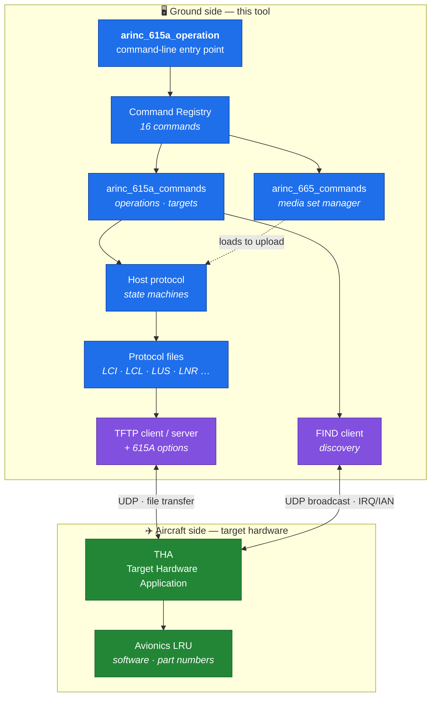
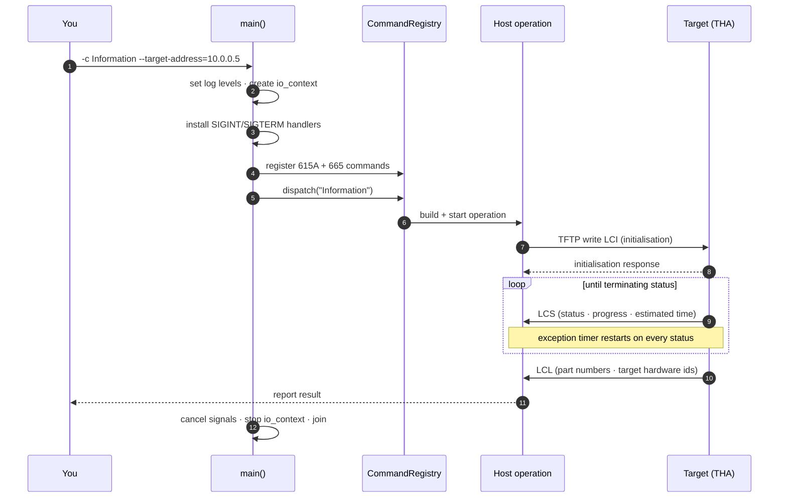
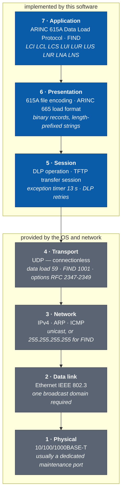
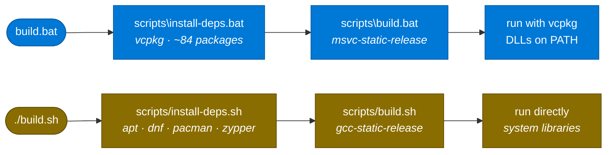

<div align="center">


# ARINC 615A Tool Suite — CLI

**Command-line implementation of the ARINC 615A Data Loading Protocol**
Discover avionics targets, read part numbers, upload and download software over Ethernet.

[](https://en.cppreference.com/w/cpp/23)
[](https://cmake.org/)
[](https://www.boost.org/)
[](https://visualstudio.microsoft.com/)

[](#quick-start--one-command)
[](#quick-start--one-command)
[](https://vcpkg.io/)
[](LICENSE)
[](#protocol-background)

</div>

---

## What this is

ARINC 615A is the standard the aviation industry uses to move software and data
between a ground **data loader** and **target hardware** on an aircraft — the
LRUs, computers and controllers that need software updates. It defines the
message formats, the transfer procedures, and the error detection that protects
data integrity.

This repository builds `arinc_615a_operation`, a single command-line tool that
speaks that protocol. It can:

- **discover** targets on the network (FIND),
- **interrogate** them for part numbers and versions,
- **upload** software and data to them,
- **download** software and data from them,
- and manage the **ARINC 665 media sets** the software is packaged in.

It is a trimmed distribution of the upstream
[ARINC 615A Tool Suite](https://git.thomas-vogt.de/thomas-vogt/arinc_615a) by
Thomas Vogt, reduced to what is needed to build and run the CLI, with added
setup scripts and documentation.

---

## What it does — block diagram



The tool is the **host** (ground data loader). The box on the aircraft is the
**target**. Everything on the data path is a *file* moved over TFTP — ARINC 615A
is file-driven, not message-driven. FIND is the one exception: a plain UDP
request/answer pair used to discover what is out there before a transfer.

---

## What really happens when you run it



**Two details that matter operationally.** The **exception timer** is a
watchdog: if the target goes quiet for longer than the negotiated interval, the
host fails the operation instead of hanging forever. And **the first `Ctrl-C` is
a graceful abort**, not a kill — it sends a protocol abort so the target is not
left mid-load in an undefined state. A second `Ctrl-C` terminates hard.

---

## How it works — the protocol stack

ARINC 615A is an **application-layer protocol only**. It defines no transport of
its own: it rides on TFTP over UDP over IPv4 over Ethernet. Everything below the
session layer belongs to the operating system and the network, which is why
interfacing the loader to another system is mostly a networking exercise.



### What else is on the wire

A packet capture during a load shows more than ARINC 615A:

| Protocol | Role during an operation | Driven by |
| --- | --- | --- |
| **ARINC 615A DLP** | The protocol files themselves | This tool |
| **FIND** | Discovery — IRQ (opcode 1) / IAN (opcode 2) | This tool |
| **ARINC 665** | Load and media-set format inside the transfer | This tool |
| **TFTP** (RFC 1350) | Moves every protocol file and load file | `tftp` library |
| **TFTP options** (RFC 2347–2349) | Block size, timeout, transfer size negotiation | This tool |
| **UDP** | Connectionless datagrams, no delivery guarantee | OS |
| **IPv4 / ARP / ICMP** | Addressing, MAC resolution, diagnostics | OS |
| **Ethernet 802.3** | Framing; carries the FIND broadcast | NIC / switch |

### Ports and timers

Taken from the source constants, not from the standard's text:

| Purpose | Default | Constant | Override |
| --- | --- | --- | --- |
| Data load (TFTP) | **UDP 59** | `DefaultArinc615aTftpPort` | `--server-port` |
| FIND discovery | **UDP 1001** | `Find::DefaultPort` | `--find-port` |
| TFTP packet timeout | 2 s | `DefaultArinc615aTftpTimeout` | `--tftp-timeout` |
| DLP exception timer | 13 s | `DefaultArinc615aDlpTimeout` | `--dlp-timeout` |
| DLP / TFTP retries | 1 | `DefaultArinc615a*Retries` | `--dlp-retries` |

> ⚠ The data-load port is **UDP 59, not the TFTP well-known port 69**. ARINC
> 615A-1 states it explicitly. A firewall that permits only 69 will stop the load
> before it starts.

### Interfacing it to another system

- **As a process** — invoke the CLI and read its exit code. `--targets-list`
  writes machine-readable discovery output a wrapper can parse and feed back in.
- **As a library** — link `lib/arinc_615a` and implement the
  `…OperationHandler` interfaces to receive progress, status and completion
  callbacks. The CLI is itself only a thin consumer of that API.
- **Software to load** arrives as ARINC 665 media sets, managed through the
  Media Set Manager directory.

Network conditions that must hold:

- Host and target must share a **broadcast domain**, or FIND discovers nothing.
  Across a router, address the target directly with `--target-address`.
- **UDP 59 and UDP 1001** must not be filtered between host and target.
- On a **multi-homed host**, set `--local-tftp-address` and
  `--local-find-address` explicitly or the sockets may bind to the wrong NIC.

---

## Setup — what the scripts do

Two paths, one command each. **Windows** gets its libraries from vcpkg;
**Linux** gets them from the distro, which is why it is minutes rather than hours.



The Windows path in detail — the two hazards marked are the ones that will
otherwise cost you an afternoon:


### Why `C:\vb`, `C:\vp`, `C:\vi`

Not cosmetic. vcpkg builds `libiconv` with autotools, and during `make install`
it forms a path by concatenating the package directory **with the full install
prefix**. Under a normal project location that blows past Windows' 260-character
limit, libtool falls back to the `\\?\` long-path form, and `cl.exe` rejects it:

```
cl : Command line warning D9002 : ignoring unknown option '//?/C:/…/iconv.lib'
iconv.obj : error LNK2019: unresolved external symbol libiconv_open
.libs\iconv.exe : fatal error LNK1120: 7 unresolved externals
```

The import library is silently dropped and the port dies — after about 40
minutes of work. Short roots avoid it entirely. Full detail in
[docs/BUILD.md](docs/BUILD.md).

---

## Quick start — one command

From a fresh clone, this installs every dependency, builds, and runs the tool:

**Windows**

```bat
build.bat
```

**Linux**

```bash
./build.sh
```

That is the whole thing. Arguments pass straight through, so you can build and
run something specific in the same breath:

```bat
build.bat -c Find                REM discover targets on the network
build.bat debug -c Find          REM as a debug build
build.bat --no-run               REM install and build only
```

```bash
./build.sh -c Find
./build.sh debug -c Find
./build.sh --no-run
```

> **First run is slow.** On Windows it builds ~84 vcpkg packages and `libiconv`
> alone can run for hours on its two autotools configure passes. On Linux it
> installs distro packages, which takes minutes. Later runs take seconds. Prefer
> not to wait on Windows? Grab a prebuilt binary from [Releases](../../releases).

### Or run the steps separately

| | Windows | Linux |
| --- | --- | --- |
| Dependencies | `scripts\install-deps.bat` | `scripts/install-deps.sh` |
| Build | `scripts\build.bat release` | `scripts/build.sh release` |

Both accept `debug` or `release`, defaulting to `release`.

---

## Check before you build

If anything is missing, find out in seconds rather than forty minutes into a
vcpkg build:

```bat
scripts\doctor.bat
```
```bash
scripts/doctor.sh
```

`doctor` checks the compiler, CMake ≥ 4.3 (and tells you the Visual Studio copy
is 3.31 and doesn't count), Ninja, git, whether the dependency sources are
vendored, whether `git.thomas-vogt.de` is reachable, the vcpkg path lengths, the
binary-cache state and free disk. Every failure prints the exact command that
fixes it. It exits non-zero if the build cannot succeed.

---

## Offline builds

The build has exactly **three** network dependencies. Remove them and it works
air-gapped.

### 1. The five sibling projects — the real blocker

`CMakeLists.txt` clones `helper`, `arinc_649`, `arinc_665`, `tftp` and
`commands` from `git.thomas-vogt.de` at configure time. **The project already
supports vendoring them** — it prefers an in-tree checkout if one exists:

```cmake
if( IS_DIRECTORY ${CMAKE_SOURCE_DIR}/helper )
  set( FETCHCONTENT_SOURCE_DIR_HELPER ${CMAKE_SOURCE_DIR}/helper )
endif()
```

Populate that hook once, on a connected machine:

```bat
scripts\fetch-deps.bat            REM clone or update all five
scripts\fetch-deps.bat --status   REM report what is vendored
```
```bash
scripts/fetch-deps.sh
scripts/fetch-deps.sh --status
```

After that, configure never touches the network. The five directories are
git-ignored — they are a local cache, not part of this repository.

### 2. vcpkg packages (Windows only)

Populated on first build and reused from `%LOCALAPPDATA%\vcpkg\archives`.
Copy that directory to the offline machine and the ~84 packages restore in
seconds instead of being rebuilt — which is what turns a multi-hour first build
into a short one, and avoids the libiconv autotools compile entirely.

### 3. System packages (Linux only)

Install them once from the distro, or pre-download with
`apt-get install --download-only`. Linux never builds libiconv from source.

### Air-gapped checklist

| On a connected machine | Carry across | Result |
| --- | --- | --- |
| `scripts/fetch-deps.*` | the five dependency directories | configure needs no network |
| one full build | `%LOCALAPPDATA%\vcpkg\archives` | vcpkg needs no network (Windows) |
| — | distro packages or a prepared image | no package manager needed (Linux) |

Verify with `doctor`: **"Dependency sources — all 5 vendored in-tree — configure
works OFFLINE"** is the line to look for.

---

## Using the CLI

```bat
arinc_615a_operation.exe --help                REM list all commands
arinc_615a_operation.exe -c <Command> --help   REM options for one command
arinc_615a_operation.exe -c <Command> [options]
```

### ARINC 615A operations

| Command | Purpose |
| --- | --- |
| `Find` | FIND query — discover target hardware on the network |
| `Targets` | List discovered ARINC 615A targets |
| `Information` | Read part numbers and versions from a target |
| `Upload` | Upload software/data to a target |
| `AdhocUpload` | Ad-hoc upload |
| `BatchUpload` | Batch upload |
| `UploadLoads` | Upload specific loads |
| `MedDownload` | Media-defined download |
| `OpDownload` | Operator-defined download |

### ARINC 665 media-set management

| Command | Purpose |
| --- | --- |
| `Create` | Create an ARINC 665 Media Set Manager |
| `ImportMediaSet` | Import a media set |
| `ImportMediaSetXml` | Import a media set from XML |
| `ListMediaSets` | List registered media sets |
| `ListLoads` | List loads across all media sets |
| `ListBatches` | List batches across all media sets |
| `RemoveMediaSet` | Remove a media set |

### Smoke test — no hardware needed

```bat
arinc_615a_operation.exe -c Find
```

Broadcasts a FIND request to `255.255.255.255`, waits out its 3-second timeout,
reports what it found (nothing, on a network without avionics hardware), exits `0`.

Every other operation needs a reachable ARINC 615A target.

---

## ⚠ Two option-parsing quirks

These are in how the command registry declares options. Both cost time if you
don't know them:

| Symptom | Cause | Do this |
| --- | --- | --- |
| `the required argument for option '--timeout' is missing` | Space-separated short options get mis-consumed | Use `--timeout=5`, not `-t 5` |
| `the argument ('--timeout') for option '--log-level' is invalid` | `-l` is bound to **both** `--log-level` and `--targets-list` inside `Find` | Avoid `-l` on that subcommand |

## ⚠ On Windows the executable needs DLLs on PATH

`build.bat` handles this for you. Running the exe **directly** does not.

The Windows build links against the **dynamic** `x64-windows` triplet with
`VCPKG_APPLOCAL_DEPS=OFF`, so dependency DLLs are **not** copied beside the exe.
Double-clicking it in Explorer fails with a missing-DLL error. Match the
configuration — never mix release DLLs into a debug binary:

```bat
set "PATH=C:\vi\x64-windows\bin;%PATH%"        REM release
set "PATH=C:\vi\x64-windows\debug\bin;%PATH%"  REM debug
```

**Linux has no such problem** — it links against system libraries already on the
loader search path:

```bash
cmake-build-gcc-static-release/app/arinc_615a_operation/arinc_615a_operation -c Find
```

The [prebuilt Windows binary](../../releases) is bundled with its DLLs and needs
no `PATH` setup either.

---

## Repository layout

```
.
├── app/arinc_615a_operation/   CLI application — main(), signals, wiring
├── lib/
│   ├── arinc_615a/             protocol library
│   │   ├── host/               ground-loader state machines
│   │   ├── target/             target-hardware state machines
│   │   ├── files/              LCI · LCL · LUS · LNR … encode/decode
│   │   ├── find/               discovery: packets · clients · servers
│   │   ├── tftp/               615A-specific TFTP options
│   │   └── information/        shared value types
│   └── arinc_615a_commands/    CLI command wrappers
├── cmake/                      toolchain files, presets, install rules
├── scripts/                    install-deps · build   (.bat Windows, .sh Linux)
├── docs/                       BUILD.md · ARCHITECTURE.md · CODE-TRACE.md
├── build.bat                   one command: deps + build + run  (Windows)
└── build.sh                    one command: deps + build + run  (Linux)
```

---

## Documentation

| Document | What's in it |
| --- | --- |
| **[docs/README.md](docs/README.md)** | **Start here** — a map of all five documents, what each is for, and a reading order for a new maintainer |
| **[CONTRIBUTING.md](CONTRIBUTING.md)** | The three local fixes that must survive an upstream merge, layout rules, line-ending rules, and how to regenerate the documents |
| **[docs/ARCHITECTURE.md](docs/ARCHITECTURE.md)** | How the codebase works — layer map, directory-by-directory walkthrough, protocol file table, operation flow, design conventions |
| **[docs/CODE-TRACE.md](docs/CODE-TRACE.md)** | Function-by-function trace from `main()` to the wire and back through the handler callbacks, every entry carrying its `file:line`. 23 sections covering concurrency, dispatch, each protocol operation, the file codec, the TFTP shim, timers and abort, status codes, customisation points and known defects |
| **[docs/ARINC615A-CLI-Installation-and-Test-Procedure.docx](docs/ARINC615A-CLI-Installation-and-Test-Procedure.docx)** | **Engineering document (Word).** Step-by-step install for Windows and Linux, command-by-command operation, a 16-case test procedure with expected results, troubleshooting, and 13 diagrams including the OSI mapping, the protocols on the wire, and how to interface the loader to other systems |
| **[docs/BUILD.md](docs/BUILD.md)** | Every build stage in order, all dependencies and how to install them, the failure modes that will otherwise stop you, and every linked resource in one place |

---

## Dependencies

The setup scripts install all of this. It's listed so you know what lands on
your machine.

| | Windows | Linux |
| --- | --- | --- |
| Compiler | Visual Studio 2022 C++ build tools | GCC 13+ |
| Build system | **CMake ≥ 4.3** + Ninja | **CMake ≥ 4.3** + Ninja |
| Libraries from | **vcpkg**, via `vcpkg.json` (~84 packages) | **distro packages** — apt · dnf · pacman · zypper |
| Installed to | `C:\vi` (plus `C:\vb`, `C:\vp` as vcpkg scratch) | system prefix |
| DLL/so handling | needs `PATH` set — see above | nothing to do |

The compiler must support **C++23**; every target sets `cxx_std_23`.

Most distributions ship a CMake older than 4.3, so `scripts/install-deps.sh`
fetches the official Kitware binary into a git-ignored `.toolchain/` when needed.

**Libraries** — Boost (asio, crc, endian, exception, hash2, multi-index,
program-options, property-tree, serialization, signals2, test),
[libxml++](https://libxmlplusplus.github.io/libxmlplusplus/),
[spdlog](https://github.com/gabime/spdlog),
[fmt](https://fmt.dev/), pkgconf. `libxml++` is required by the `arinc_665`
dependency rather than by this repository's own libraries.

**Sibling projects**, cloned during configure via `FetchContent`:
[helper](https://git.thomas-vogt.de/thomas-vogt/helper) ·
[arinc_649](https://git.thomas-vogt.de/thomas-vogt/arinc-649) ·
[arinc_665](https://git.thomas-vogt.de/thomas-vogt/arinc_665) ·
[tftp](https://git.thomas-vogt.de/thomas-vogt/tftp) ·
[commands](https://git.thomas-vogt.de/thomas-vogt/commands)

> Configure **requires network access to `git.thomas-vogt.de`**. There is no
> vendored copy and no offline fallback.

### Other toolchains

`build.bat` drives the **MSVC** presets and `build.sh` drives the **GCC** ones.
Presets also exist for **Clang** and a **MinGW cross-build** (Windows binaries
from Linux), each in static/shared × debug/release. Those two come from upstream
and are not exercised by either script:

```bash
cmake --preset clang-static-release
cmake --build cmake-build-clang-static-release
```

> **The Linux scripts have not been run.** They were written against the presets
> and distro package names on a Windows machine with no Linux environment
> available, and are syntax-checked only. Package names are the most likely
> thing to need adjusting across distribution releases. See
> [docs/BUILD.md §7](docs/BUILD.md) for the detail.

---

## Protocol background

This library implements **Supplements 2, 3 and 4**. Selected changes it accounts
for:

| Supplement | Notable changes |
| --- | --- |
| **615A-1** | Uppercase protocol filenames · UDP port 59 · block-size option mandatory for host · transfer-size and timeout options forbidden · exception timer added to status files |
| **615A-2** | SNIP renamed **FIND** and made optional before transfer · protocol version `A3` · `LCL` gains multiple target hardware and part-number amendments · exception timer and estimated time defined precisely |
| **615A-3** | Transfer-size and timeout options optional · **checksum** and **port** options added · status `0004` (in progress with description) · part-number option added but unusable as written |
| **615A-4** | Part-number option corrected · checksum option description updated |

**References** — ARINC 615A-4 (Software Data Loader Using Ethernet Interface),
ARINC 665-5 (Loadable Software Standards), ARINC 649 (Common Terminology and
Functions for Software Distribution and Loading).

---

## Licence

[](LICENSE)

Mozilla Public License 2.0. Upstream project © Thomas Vogt —
<https://git.thomas-vogt.de/thomas-vogt/arinc_615a>. The MPL requires this
licence and its attribution to be retained in redistributions, including this one.

ARINC® is a trademark of its respective owner. This project implements the
publicly documented ARINC 615A protocol and is **not affiliated with, endorsed
by, or a product of ARINC**. The ARINC standards themselves are published by
SAE ITC and are not redistributed here.
