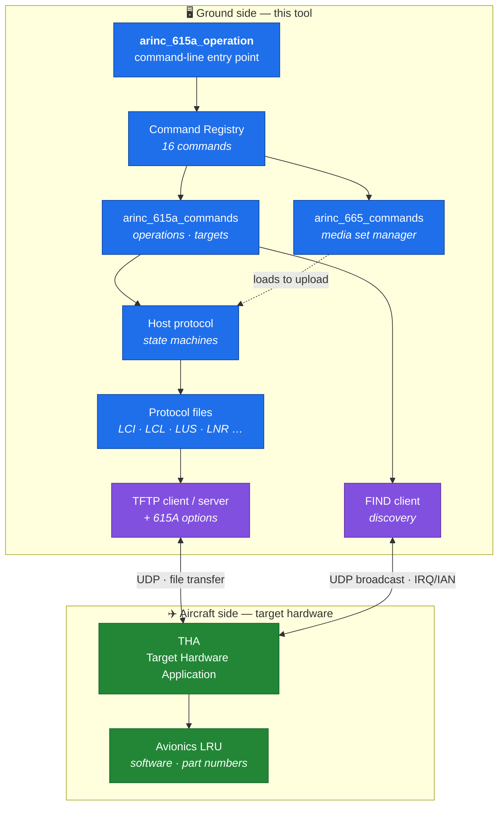
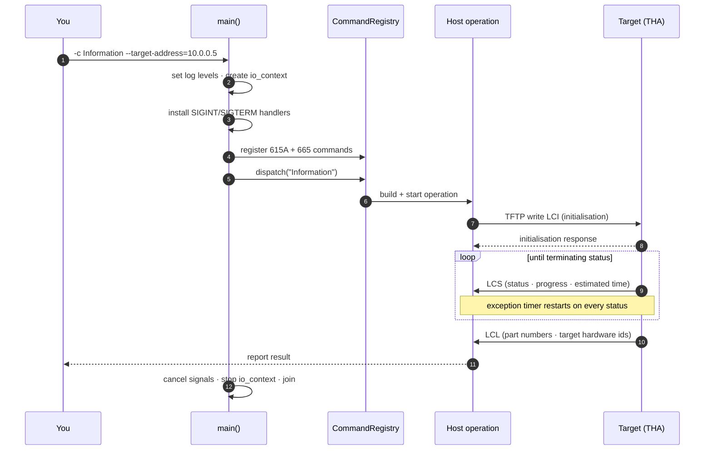
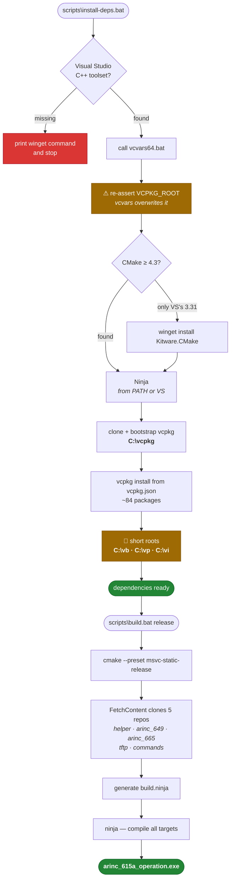

<div align="center">


# ARINC 615A Tool Suite — CLI

**Command-line implementation of the ARINC 615A Data Loading Protocol**
Discover avionics targets, read part numbers, upload and download software over Ethernet.

[](https://en.cppreference.com/w/cpp/23)
[](https://cmake.org/)
[](https://www.boost.org/)
[](https://visualstudio.microsoft.com/)

[](#quick-start)
[](https://vcpkg.io/)
[](LICENSE)
[](#protocol-background)

</div>

---

## What this is

ARINC 615A is the standard the aviation industry uses to move software and data
between a ground **data loader** and **target hardware** on an aircraft — the
LRUs, computers and controllers that need software updates. It defines the
message formats, the transfer procedures, and the error detection that protects
data integrity.

This repository builds `arinc_615a_operation`, a single command-line tool that
speaks that protocol. It can:

- **discover** targets on the network (FIND),
- **interrogate** them for part numbers and versions,
- **upload** software and data to them,
- **download** software and data from them,
- and manage the **ARINC 665 media sets** the software is packaged in.

It is a trimmed distribution of the upstream
[ARINC 615A Tool Suite](https://git.thomas-vogt.de/thomas-vogt/arinc_615a) by
Thomas Vogt, reduced to what is needed to build and run the CLI, with added
setup scripts and documentation.

---

## What it does — block diagram



The tool is the **host** (ground data loader). The box on the aircraft is the
**target**. Everything on the data path is a *file* moved over TFTP — ARINC 615A
is file-driven, not message-driven. FIND is the one exception: a plain UDP
request/answer pair used to discover what is out there before a transfer.

---

## What really happens when you run it



**Two details that matter operationally.** The **exception timer** is a
watchdog: if the target goes quiet for longer than the negotiated interval, the
host fails the operation instead of hanging forever. And **the first `Ctrl-C` is
a graceful abort**, not a kill — it sends a protocol abort so the target is not
left mid-load in an undefined state. A second `Ctrl-C` terminates hard.

---

## Setup — what the scripts do



### Why `C:\vb`, `C:\vp`, `C:\vi`

Not cosmetic. vcpkg builds `libiconv` with autotools, and during `make install`
it forms a path by concatenating the package directory **with the full install
prefix**. Under a normal project location that blows past Windows' 260-character
limit, libtool falls back to the `\\?\` long-path form, and `cl.exe` rejects it:

```
cl : Command line warning D9002 : ignoring unknown option '//?/C:/…/iconv.lib'
iconv.obj : error LNK2019: unresolved external symbol libiconv_open
.libs\iconv.exe : fatal error LNK1120: 7 unresolved externals
```

The import library is silently dropped and the port dies — after about 40
minutes of work. Short roots avoid it entirely. Full detail in
[docs/BUILD.md](docs/BUILD.md).

---

## Quick start

```bat
scripts\install-deps.bat
scripts\build.bat release
```

Then run it:

```bat
set "PATH=C:\vi\x64-windows\bin;%PATH%"
cmake-build-msvc-static-release\app\arinc_615a_operation\arinc_615a_operation.exe --help
```

`build.bat` takes `debug` or `release`; it defaults to `release`.

> **First run is slow.** ~84 vcpkg packages get built, and `libiconv` alone can
> run for hours on its two autotools configure passes. Later runs take minutes,
> served from the vcpkg binary cache. Prefer not to wait? Grab a prebuilt binary
> from [Releases](../../releases).

---

## Using the CLI

```bat
arinc_615a_operation.exe --help                REM list all commands
arinc_615a_operation.exe -c <Command> --help   REM options for one command
arinc_615a_operation.exe -c <Command> [options]
```

### ARINC 615A operations

| Command | Purpose |
| --- | --- |
| `Find` | FIND query — discover target hardware on the network |
| `Targets` | List discovered ARINC 615A targets |
| `Information` | Read part numbers and versions from a target |
| `Upload` | Upload software/data to a target |
| `AdhocUpload` | Ad-hoc upload |
| `BatchUpload` | Batch upload |
| `UploadLoads` | Upload specific loads |
| `MedDownload` | Media-defined download |
| `OpDownload` | Operator-defined download |

### ARINC 665 media-set management

| Command | Purpose |
| --- | --- |
| `Create` | Create an ARINC 665 Media Set Manager |
| `ImportMediaSet` | Import a media set |
| `ImportMediaSetXml` | Import a media set from XML |
| `ListMediaSets` | List registered media sets |
| `ListLoads` | List loads across all media sets |
| `ListBatches` | List batches across all media sets |
| `RemoveMediaSet` | Remove a media set |

### Smoke test — no hardware needed

```bat
arinc_615a_operation.exe -c Find
```

Broadcasts a FIND request to `255.255.255.255`, waits out its 3-second timeout,
reports what it found (nothing, on a network without avionics hardware), exits `0`.

Every other operation needs a reachable ARINC 615A target.

---

## ⚠ Two option-parsing quirks

These are in how the command registry declares options. Both cost time if you
don't know them:

| Symptom | Cause | Do this |
| --- | --- | --- |
| `the required argument for option '--timeout' is missing` | Space-separated short options get mis-consumed | Use `--timeout=5`, not `-t 5` |
| `the argument ('--timeout') for option '--log-level' is invalid` | `-l` is bound to **both** `--log-level` and `--targets-list` inside `Find` | Avoid `-l` on that subcommand |

## ⚠ The executable needs DLLs on PATH

The build links against the **dynamic** `x64-windows` triplet with
`VCPKG_APPLOCAL_DEPS=OFF`, so dependency DLLs are **not** copied beside the exe.
Double-clicking it in Explorer fails with a missing-DLL error. Match the
configuration — never mix release DLLs into a debug binary:

```bat
set "PATH=C:\vi\x64-windows\bin;%PATH%"        REM release
set "PATH=C:\vi\x64-windows\debug\bin;%PATH%"  REM debug
```

---

## Repository layout

```
.
├── app/arinc_615a_operation/   CLI application — main(), signals, wiring
├── lib/
│   ├── arinc_615a/             protocol library
│   │   ├── host/               ground-loader state machines
│   │   ├── target/             target-hardware state machines
│   │   ├── files/              LCI · LCL · LUS · LNR … encode/decode
│   │   ├── find/               discovery: packets · clients · servers
│   │   ├── tftp/               615A-specific TFTP options
│   │   └── information/        shared value types
│   └── arinc_615a_commands/    CLI command wrappers
├── cmake/                      toolchain files, presets, install rules
├── scripts/                    install-deps.bat · build.bat · _env.bat
└── docs/                       BUILD.md · ARCHITECTURE.md
```

---

## Documentation

| Document | What's in it |
| --- | --- |
| **[docs/ARCHITECTURE.md](docs/ARCHITECTURE.md)** | How the codebase works — layer map, directory-by-directory walkthrough, protocol file table, operation flow, design conventions |
| **[docs/BUILD.md](docs/BUILD.md)** | Every build stage in order, all dependencies and how to install them, and the failure modes that will otherwise stop you |

---

## Dependencies

**Toolchain** — Visual Studio 2022 C++ build tools, **CMake ≥ 4.3**, Ninja, Git.
The compiler must support **C++23**.

**Libraries** (vcpkg, from `vcpkg.json`) — Boost (asio, crc, endian, exception,
hash2, multi-index, program-options, property-tree, serialization, signals2,
test), [libxml++](https://libxmlplusplus.github.io/libxmlplusplus/),
[spdlog](https://github.com/gabime/spdlog), pkgconf. ~84 packages resolved.

**Sibling projects**, cloned during configure via `FetchContent`:
[helper](https://git.thomas-vogt.de/thomas-vogt/helper) ·
[arinc_649](https://git.thomas-vogt.de/thomas-vogt/arinc-649) ·
[arinc_665](https://git.thomas-vogt.de/thomas-vogt/arinc_665) ·
[tftp](https://git.thomas-vogt.de/thomas-vogt/tftp) ·
[commands](https://git.thomas-vogt.de/thomas-vogt/commands)

> Configure **requires network access to `git.thomas-vogt.de`**. There is no
> vendored copy and no offline fallback.

### Other toolchains

Presets also exist for **GCC**, **Clang** and a **MinGW cross-build**, each in
static/shared × debug/release, for Linux and Windows. They come from upstream and
are not exercised by `scripts\build.bat`, which is Windows/MSVC only.

```bash
cmake --preset gcc-static-release
cmake --build cmake-build-gcc-static-release
```

---

## Protocol background

This library implements **Supplements 2, 3 and 4**. Selected changes it accounts
for:

| Supplement | Notable changes |
| --- | --- |
| **615A-1** | Uppercase protocol filenames · UDP port 59 · block-size option mandatory for host · transfer-size and timeout options forbidden · exception timer added to status files |
| **615A-2** | SNIP renamed **FIND** and made optional before transfer · protocol version `A3` · `LCL` gains multiple target hardware and part-number amendments · exception timer and estimated time defined precisely |
| **615A-3** | Transfer-size and timeout options optional · **checksum** and **port** options added · status `0004` (in progress with description) · part-number option added but unusable as written |
| **615A-4** | Part-number option corrected · checksum option description updated |

**References** — ARINC 615A-4 (Software Data Loader Using Ethernet Interface),
ARINC 665-5 (Loadable Software Standards), ARINC 649 (Common Terminology and
Functions for Software Distribution and Loading).

---

## Licence

[](LICENSE)

Mozilla Public License 2.0. Upstream project © Thomas Vogt —
<https://git.thomas-vogt.de/thomas-vogt/arinc_615a>. The MPL requires this
licence and its attribution to be retained in redistributions, including this one.
