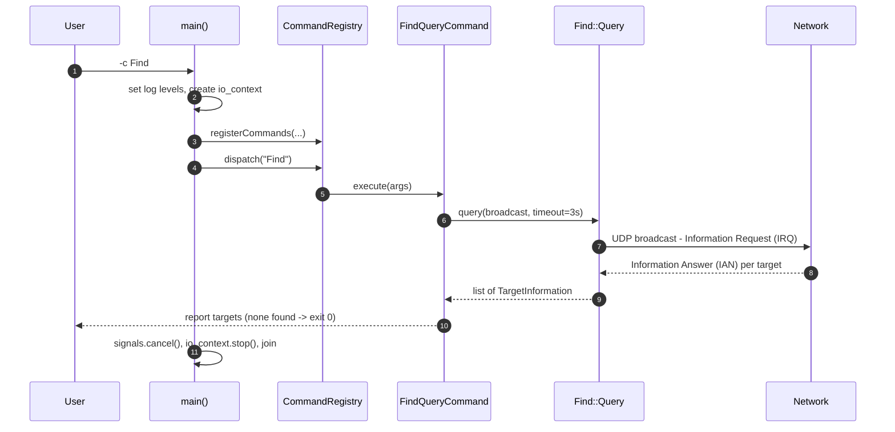
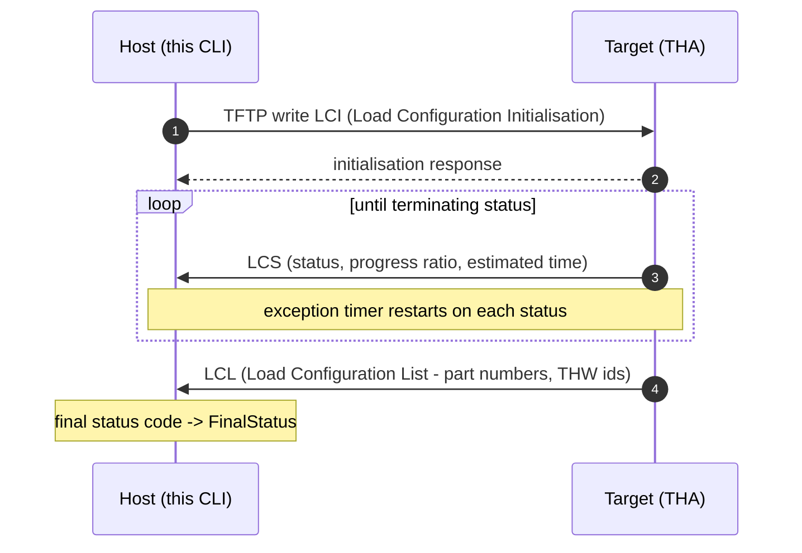

# Architecture — what the code actually does

This document explains the codebase: how the layers fit together, what each
directory is responsible for, and how a data-loading operation flows through the
system from a CLI argument to TFTP packets on the wire.

For build instructions see [BUILD.md](BUILD.md).

---

## 1. The protocol in one page

ARINC 615A is a **file-driven protocol layered on TFTP**. Nothing is a custom
binary message on the data path — the host and the target exchange *files* with
fixed three-letter extensions, and the state machine is driven by which file
appears next.

An operation always follows the same shape:

1. The **host** (ground data loader) writes an **initialisation** file to the target.
2. The **target** (the avionics box, "THA" — target hardware application) answers.
3. The target repeatedly sends **status** files reporting progress.
4. A terminating status carries the final status code.

| Extension | File | Direction |
| --- | --- | --- |
| `LCI` | Load Configuration Initialisation | host → target |
| `LCL` | Load Configuration List | target → host |
| `LCS` | Load Configuration Status | target → host |
| `LUI` | Load Upload Initialisation | host → target |
| `LUR` | Load Upload Request | target → host |
| `LUS` | Load Upload Status | target → host |
| `LNI`/`LNR` | Download Initialisation / Request | host → target |
| `LND`/`LNL`/`LNO` | Download definition / list / operator-defined | varies |
| `LNA` | Download Answer | target → host |
| `LNS` | Download Status | target → host |

**FIND** is the separate discovery protocol (renamed from SNIP in 615A-2). It is
*not* file-based — it is a small UDP request/answer pair:

| Opcode | Packet |
| --- | --- |
| `1` | Information Request (IRQ) |
| `2` | Information Answer (IAN) |

---

## 2. Layer map

```
CLI  ──▶  Commands  ──▶  Host protocol  ──▶  Files  ──▶  TFTP  ──▶  network
                              │                  ▲
                              └──▶  FIND  ───────┘ (discovery, plain UDP)
```

| Layer | Directory | Responsibility |
| --- | --- | --- |
| Application | `app/arinc_615a_operation/` | `main()`, signal handling, wiring the registry |
| Commands | `lib/arinc_615a_commands/` | One class per CLI command; parses options, drives an operation |
| Operations | `lib/arinc_615a/host/`, `lib/arinc_615a/target/` | Protocol state machines |
| Files | `lib/arinc_615a/files/` | Encode/decode every protocol file |
| Information | `lib/arinc_615a/information/` | Value types shared across layers |
| Discovery | `lib/arinc_615a/find/` | FIND client and server |
| Transport | `lib/arinc_615a/tftp/` | ARINC 615A-specific TFTP options and errors |

The strict direction of dependency is downward. `files/` knows nothing about
`host/`; `host/` knows nothing about `arinc_615a_commands/`.

---

## 3. Directory by directory

### `app/arinc_615a_operation/`

The entire application is one file, `arinc_615a_operation.cpp`. It:

1. Sets every library's log level to `warn` (`Arinc615a`, `Tftp`, `Arinc665`,
   `Arinc649`, `Commands`, `Helper` each expose a `setLogLevel`).
2. Gets the singleton `Commands::CommandRegistry::instance()`.
3. Creates a Boost.Asio `io_context` and a `signal_set` for `SIGINT`/`SIGTERM`.
4. Calls `Arinc615aCommands::registerCommands(...)` and
   `Arinc665Commands::registerCommands(...)` — this is what populates the command
   list you see in `--help`.
5. Runs the `io_context` on a `std::jthread`, dispatches the command, then stops
   and joins cleanly.

**Abort semantics.** Two signals are wired to two distinct actions. The first
`Ctrl-C` fires `abortSignal()` — a *graceful* protocol abort, letting the
operation send its abort request to the target. A second `Ctrl-C` fires
`terminateSignal()`, a hard stop. This matters on a real aircraft: yanking a
data load mid-transfer without telling the target leaves it in an undefined
state, so the first interrupt is deliberately polite.

### `lib/arinc_615a_commands/`

Adapts the protocol library to the command registry. Split in two:

- `operations/` — `InformationOperationCommand`, `UploadOperationCommand`,
  `AdhocUploadOperationCommand`, `BatchUploadOperationCommand`,
  `UploadLoadsOperationCommand`, `MediaDefinedDownloadOperationCommand`,
  `OperatorDefinedDownloadOperationCommand`
- `targets/` — `FindQueryCommand`, `ListTargetsCommand`

Each command owns its Boost.Program_options description, validates arguments,
constructs the matching operation, and reports progress. This is the layer where
the two option-parsing quirks documented in the README live — the `-l` collision
between `--log-level` and `--targets-list` is a duplicate short-option
registration here, not a bug in Boost.

### `lib/arinc_615a/host/`

The **ground data loader** side — the side this CLI plays. Public interfaces are
headers; the state machines live in `implementation/`:

| Interface | Implementation | Operation |
| --- | --- | --- |
| `InformationOperation` | `InformationOperationImpl` | Read part numbers/versions |
| `UploadOperation` | `UploadOperationImpl` | Upload software/data |
| `MediaDefinedDownloadOperation` | `MediaDefinedDownloadOperationImpl` | Media-defined download |
| `OperatorDefinedDownloadOperation` | `OperatorDefinedDownloadOperationImpl` | Operator-defined download |
| `Protocol` | `ProtocolImpl` | Owns the TFTP server/client and dispatches |

`OperationImpl` is the shared base holding the pieces every operation needs:
the exception timer, status polling, and the final-status transition.

Each operation has a matching `…Handler` interface — a callback surface the
caller implements to receive progress, status changes and completion.
`BatchUploadOperationProxy` composes several uploads into one batch.

### `lib/arinc_615a/target/`

The mirror image: the **target hardware** side, for building a simulated THA or
an actual loadable device. Same shape — interface headers plus `implementation/`
— with the addition of `ErrorOperation`, used to reject an operation the target
cannot service. This CLI does not use `target/`; it is what
`arinc_615a_test_tha` (not shipped here) is built from.

### `lib/arinc_615a/files/`

Every protocol file gets a class that encodes and decodes it, grouped by
operation: `files/information/`, `files/upload/`, `files/download/`.

Shared machinery at the top level:

- `ProtocolFile` — base class; version and file-type handling
- `ProtocolFilename` — the three-letter extension mapping (§1); note 615A-1
  requires filenames to be uppercase
- `ProtocolFileTypeDescription` — enum ↔ human-readable text
- `InitializationFile` — the common initialisation-file shape
- `String` — the protocol's length-prefixed, null-terminated string encoding.
  615A-2 allows the declared length to exceed the actual text, which is why this
  is a dedicated type rather than a raw `std::string` read
- `Ratio` — the progress fraction used in status files
- `ProtocolFileStatistic`, `ProtocolFileLogger` — instrumentation

Every one of these has a matching `test/…Test.cpp` compiled into the
`arinc_615a_test` object library.

### `lib/arinc_615a/find/`

The discovery protocol, in three parts:

- `packets/` — `Packet`, `Packets`, `OpcodeDescription`, `PacketHandler`,
  `PacketStatistic`. The `ParameterList` enum names the fields of an answer
  (`ThwId`, and the rest of the target's identity).
- `clients/` — `Client` and `Query`; what `-c Find` drives. Broadcasts an IRQ,
  collects IANs until the timeout expires.
- `servers/` — `Server`; the target-side responder.

`TargetInformation` is the decoded result: one discovered target.

### `lib/arinc_615a/tftp/`

Not a TFTP implementation — that comes from the external `tftp` library. This is
the ARINC 615A-specific glue:

- `Arinc615aOptions` — the TFTP option extensions the standard adds. Which are
  available depends on the supplement: 615A-1 mandates the *block size* option
  and forbids *transfer size* and *timeout*; 615A-3 makes transfer size and
  timeout optional and adds the *checksum* and *port* options; 615A-4 corrects
  the *part number* option, which was unusable as specified in 615A-3.
- `ErrorMessage` — maps protocol errors onto TFTP error packets.
- `clients/`, `servers/` — the two roles.

### `lib/arinc_615a/information/`

Plain value types shared by every layer: `PartNumber`, `TargetHardware`,
`Status`, `DownloadStatus`, `UploadStatus`, `UploadLoadStatus`,
`DownloadFileStatus`, `InitializationResponse`, `Ratio`. No protocol logic.

### Top level of `lib/arinc_615a/`

- `Arinc615a.hpp` — the `OperationType` enum (`Information`, `Upload`,
  `MediaDefinedDownload`, `OperatorDefinedDownload`) and library-wide setup
- `StatusCode` / `StatusCodeDescription` — the wire status codes and the
  conversions between `StatusCode`, `FinalStatus` and `AbortRequest`
- `Arinc615aVersionDescription` — protocol version (`A2`, `A3`, `A4`) handling
- `TargetId`, `Arinc615aConfiguration`, `Arinc615aException`
- `Version.hpp.in` — configured at build time into `Version.hpp`

---

## 4. How a command flows

Taking `-c Find` end to end:



And an `Information` operation, which is file-driven rather than packet-driven:



The **exception timer** is the safety net: if the target stops sending status
files for longer than the negotiated interval, the host declares the operation
failed rather than waiting forever. 615A-2 tightened its definition, which is why
it is modelled explicitly in `OperationImpl` rather than being an ad-hoc timeout.

---

## 5. Design conventions worth knowing

**Interface / implementation split.** Public headers in `host/` and `target/`
declare pure interfaces; concrete classes live in `implementation/` and are not
installed. Callers depend on the interface and a factory, never the impl.

**Handler callbacks, not inheritance.** Progress is delivered through
`…OperationHandler` interfaces you implement, keeping the state machines free of
UI concerns. That is exactly how `arinc_615a_commands` prints progress.

**Everything is exported deliberately.** `ARINC_615A_EXPORT` comes from a
generated `arinc_615a_export.h` (`generate_export_header`), so the library works
as both a static and a shared build — hence the four preset variants.

**Tests live beside the code.** Every `files/`, `find/` and `information/`
subdirectory has a `test/` folder compiled into `arinc_615a_test`, an
`EXCLUDE_FROM_ALL` **object library**. It is only linked if a test application is
added to the build; this repository ships no such application, so those sources
compile only on demand.

**One library, many subdirectories.** `lib/arinc_615a/*/CMakeLists.txt` files do
not create targets. They call `target_sources( arinc_615a … )` on the single
library defined in `lib/arinc_615a/CMakeLists.txt`. That is why moving a
subdirectory out of the tree breaks the build in a non-obvious way.

---

## 6. External dependencies and what they carry

| Project | What this codebase uses it for |
| --- | --- |
| `helper` | Shared utilities, logging setup, exception tags (`AdditionalInfoTag`) |
| `arinc_649` | Common terminology/functions for software distribution |
| `arinc_665` | Loadable software media sets — the `Create`/`Import`/`List*` commands |
| `tftp` | The TFTP implementation the protocol rides on |
| `commands` | The `CommandRegistry` and command-line plumbing |
| Boost | Asio (all I/O), Program_options, Serialization, Signals2, CRC, Endian |
| libxml++ | XML media-set import |
| spdlog | Logging |

The ARINC 665 commands are in the same binary because loading software onto a
target and managing the media sets that software comes from are the same
workflow in practice.
